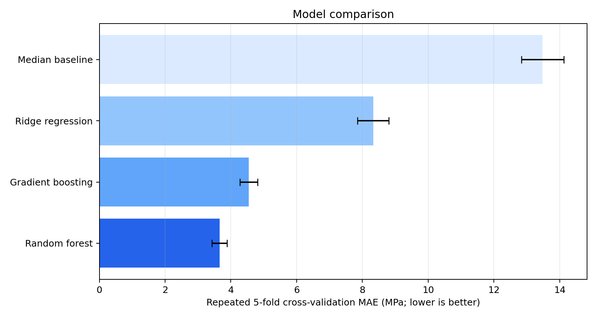
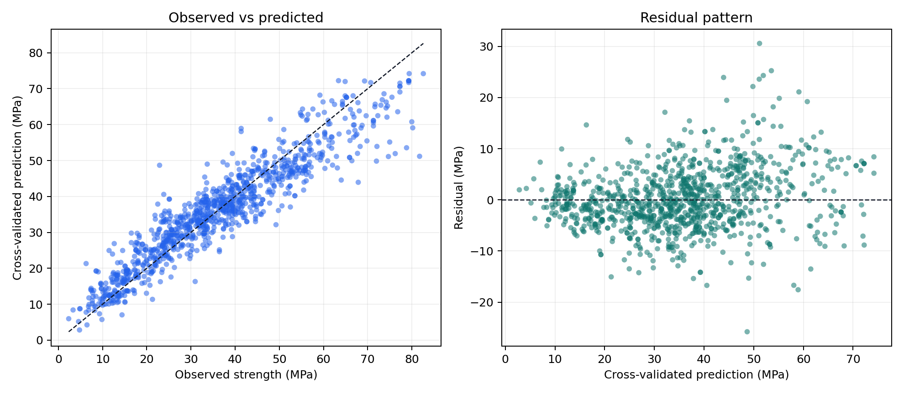
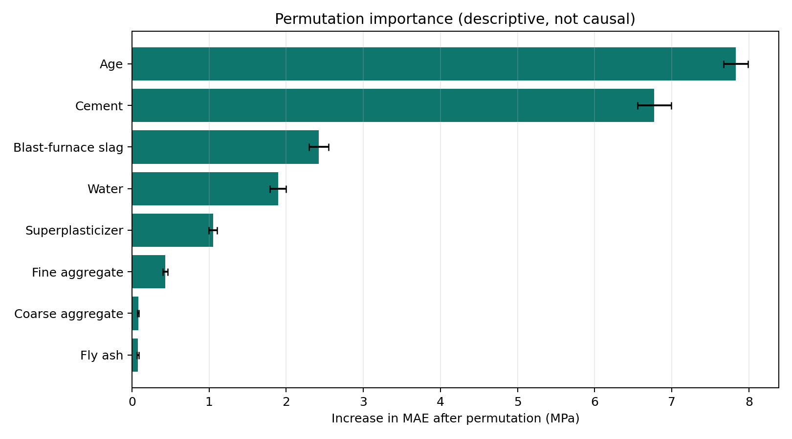

# Concrete Compressive Strength — Reproducible ML Study

A regression study of how mixture composition and curing age relate to concrete compressive strength. The repository preserves an early machine-learning proof of concept associated with an internship at the National Institute of Disaster Management (NIDM) and adds a clean, deterministic evaluation against a simple baseline.

> **Scope:** educational proof of concept, not a deployed system and not engineering guidance. The dataset is a public observational benchmark; predictions must not be used to approve concrete formulations or structures.

## Problem

Concrete strength testing is time-consuming, so this study asks a narrower analytical question: how well can common regression models estimate measured compressive strength from eight recorded mixture and age variables in the UCI benchmark dataset?

## Data

The repository uses I-Cheng Yeh's [Concrete Compressive Strength dataset](https://doi.org/10.24432/C5PK67) from the UCI Machine Learning Repository:

- 1,030 observations;
- eight numeric inputs describing mixture components and curing age;
- compressive strength in MPa as the target;
- no missing values reported by UCI;
- licensed under [CC BY 4.0](https://creativecommons.org/licenses/by/4.0/).

A value-by-value check confirmed that `Concrete.xls` has the same columns, shape and numeric contents as UCI's `Concrete_Data.xls`. See [`data/README.md`](data/README.md) for the provenance record.

## Evaluation design

`src/evaluate.py` compares four deliberately compact approaches:

- a median-prediction baseline;
- ridge regression;
- gradient boosting;
- random forest regression.

The reported results use repeated five-fold cross-validation with three repeats and a fixed seed. Every validation row is excluded from model fitting for its fold. Mean absolute error (MAE) is the primary metric because it remains in the target unit, MPa. RMSE and R² are reported as supporting diagnostics.

## Reproduced results

| Model | MAE (MPa) ↓ | RMSE (MPa) ↓ | R² ↑ |
|---|---:|---:|---:|
| Random forest | **3.656 ± 0.229** | **5.200 ± 0.461** | **0.902 ± 0.017** |
| Gradient boosting | 4.542 ± 0.271 | 5.976 ± 0.460 | 0.871 ± 0.014 |
| Ridge regression | 8.328 ± 0.474 | 10.482 ± 0.572 | 0.602 ± 0.036 |
| Median baseline | 13.479 ± 0.646 | 16.772 ± 0.851 | -0.015 ± 0.016 |

Values are means ± standard deviations across 15 validation folds from the repeated cross-validation run. They describe this public dataset and evaluation design only.



The nonlinear ensemble models perform substantially better than both the median baseline and ridge regression. The diagnostic plot below uses shuffled five-fold out-of-fold predictions from gradient boosting, so each point is predicted by a model that did not train on that row.



Errors spread more widely at higher predicted strengths, and several high-strength observations are underpredicted. That pattern is a warning against treating the aggregate MAE as uniform performance across the target range.

## Interpretation

Permutation importance from the fitted gradient-boosting model identifies age and cement content as the strongest descriptive signals in this dataset, followed by blast-furnace slag and water. These values describe model dependence, not causal effects or safe mix-design interventions.



## Conclusion

For this benchmark, nonlinear ensembles capture the relationship between composition, age and measured strength much better than a linear model. Random forest produced the lowest repeated-cross-validation error in the fixed comparison. The remaining residual structure—especially at higher strengths—shows why a single score is not sufficient for engineering use.

The study does not establish generalisation to new suppliers, laboratories, curing regimes, geographies or modern concrete formulations. A decision-grade study would need external validation, uncertainty intervals, domain review, controlled data lineage and safety-specific acceptance criteria.

## Reproduce

Tested with Python 3.13 on Windows:

```bash
python -m venv .venv
.venv\Scripts\activate
python -m pip install -r requirements.txt
python src/evaluate.py
```

The script validates the expected data shape, evaluates every model, writes `reports/model-results.csv`, and regenerates all three figures.

## Repository map

```text
.
|-- Concrete.xls                    # verified UCI dataset copy
|-- data/README.md                  # provenance, licence and verification
|-- notebooks/legacy-analysis.ipynb # historical exploratory notebook
|-- reports/
|   |-- model-results.csv
|   `-- figures/
|-- src/evaluate.py                 # deterministic benchmark and figures
`-- requirements.txt
```

The legacy notebook is retained for project chronology. It depends on an obsolete external notebook path and its stored scores are not used for the reproduced results above.

## Citation

Yeh, I. (1998). *Concrete Compressive Strength* [Dataset]. UCI Machine Learning Repository. https://doi.org/10.24432/C5PK67
